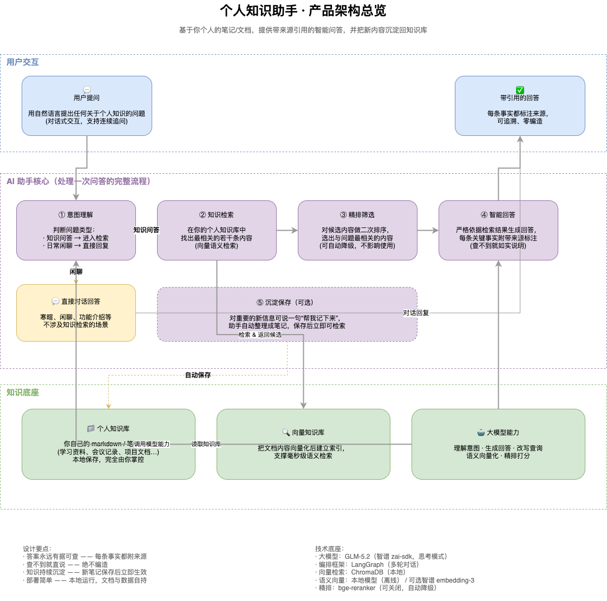

# 个人知识助手 Agent（Personal Knowledge Agent）

基于 **LangGraph + ChromaDB** 的本地个人知识库问答 Agent，LLM 走任意 OpenAI 兼容服务（默认 DeepSeek，可改 `.env` 切回智谱 GLM-5.2）：把你的 markdown 笔记检索出来，组织成带引用的回答，并支持把新内容沉淀回知识库。

- **零幻觉** —— 回答严格基于检索结果，检索不到就如实说明"知识库中未找到"，绝不编造。
- **强制引用** —— 每条结论都标注 `[来源: 文档名, 章节]`，可回溯。
- **可沉淀** —— 聊到一半想到的事，直接让 Agent 写成笔记并立即入索引。

## 仓库结构

> **所有代码都在 `personal-knowledge-agent/` 下，所有命令都必须在该目录执行。**
> 根目录没有可安装的 package，也没有 `-m` 入口 —— 模块之间按顶层名称互相导入（`from config import ...`、`from rag.retriever import Retriever`）。

```
ai-agent-demo/
├── personal-knowledge-agent/        # 全部代码
│   ├── README.md                    # ★ 主文档：安装、运行、工具、限制
│   ├── config.py                    # 唯一配置源（pydantic-settings）
│   ├── main.py                      # CLI 入口（交互式 / -q / --rebuild / --debug）
│   ├── test_agent.py                # 事实上的测试入口（端到端验证）
│   ├── prompts/  tools/  rag/  graph/   # 提示词 / 工具 / 检索 / 编排，自下而上分层
│   └── data/kb/                     # 示例知识库文档（被 git 跟踪）
├── docs/                            # 项目文档
├── drawio/                          # 架构图（.drawio 源文件 + .png 导出）
├── CLAUDE.md                        # 仓库指引：分层契约、异步约束、版本陷阱
└── Role: Senior AI Agent Architect.md   # 锁定的需求规格，实现严格对齐它
```

## 架构



分层依赖自上而下：`config` → `rag` → `tools` → `graph` → `main`。

### 图流程（`graph/builder.py`）

```
START → intent_router ─knowledge→ knowledge_search_node → rerank_node → generate_node → END
                      └─direct──→ direct_response_node → END

generate_node ──质量不达标且 retry_count < max_retry──→ rewrite_query_node → knowledge_search_node
```

## 快速开始

```bash
cd personal-knowledge-agent
python -m venv .venv && source .venv/bin/activate
pip install -r requirements.txt
cp .env.example .env      # 编辑 .env，填入 LLM_API_KEY（DeepSeek: https://platform.deepseek.com）

python main.py -q "2026年OKR是什么"   # 单次提问
python main.py                        # 交互式对话
python main.py --rebuild              # 清空 Chroma 集合并重建索引
python test_agent.py --offline        # 不调用 API/LLM，验证整条流水线可构建
```

除 `--offline` 外都需要 `LLM_API_KEY`，缺失时 `config.validate_api_key` 会在启动时快速失败。完整的配置说明（LLM 换厂商、embedding 后端切换、reranker 开关、路径规则）见主文档。

## 文档索引

| 文档 | 内容 |
|---|---|
| [`personal-knowledge-agent/README.md`](personal-knowledge-agent/README.md) | ★ 主文档：技术栈、安装配置、工具说明、依赖版本陷阱、已知限制与下一步建议 |
| [`docs/2026-09-24-配置文档.md`](docs/2026-09-24-配置文档.md) | 每个配置项的生效规则与"改了不生效"的排查方法 |
| [`docs/2026-09-24-缺陷修复报告.md`](docs/2026-09-24-缺陷修复报告.md) | 15 处缺陷的根因、修复与验证记录 |
| [`drawio/`](drawio/) | `project-architecture`（分层结构）与 `architecture-overview`（总览）架构图 |
| [`CLAUDE.md`](CLAUDE.md) | 仓库指引：节点契约、全局状态与 checkpoint 约束、依赖版本陷阱 |
| [`Role: Senior AI Agent Architect.md`](<Role: Senior AI Agent Architect.md>) | 当初锁定的需求规格（技术栈「已锁定 —— 请勿改动」） |

## 已知限制

1. **索引是"全量重建"模型** —— 启动时仅在集合为空时建索引，`data/kb/` 中被删除或修改的文件永远不会被清理；`--rebuild` 是唯一刷新手段，而它会连笔记一起清空。
2. **工具调用循环已经过真实 API 验证（2026-09-29，DeepSeek `deepseek-flash`）** —— 实测确认模型会发起工具调用、`create_note` 真的落盘写入、带 `tools=` 的请求被接受。但这只是一次性实测而非回归测试，改动该链路或换厂商后需重新验证。
3. **单用户本地场景** —— 无鉴权、无多租户，向量库与笔记均为本地明文。

完整的限制清单与下一步建议见 [`personal-knowledge-agent/README.md`](personal-knowledge-agent/README.md) 的「已知限制」与「下一步建议」两节。
